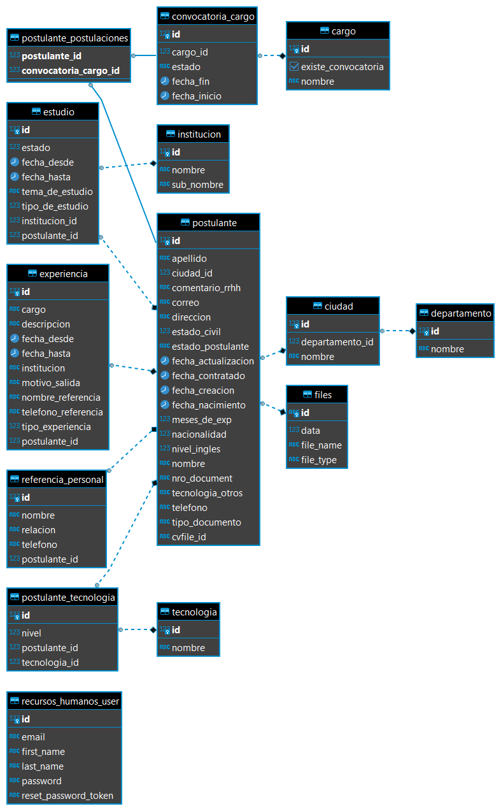

### TalentoHumano

Talento humano es una aplicación web desarrollada con Java Spring Boot, jsp, css, javascript, postgreSQL, ayudara a Recursos Humanos de Roshka con la recepción de curriculum  de un persona que quiere postularse a un puesto vacante en Roshka, mediante la recolección de Datos de un formulario, donde también se podrá adjuntar su curriculum en formato pdf o word, el postulante deberá completar un formulario y los encargados de la revisión de estos podrán visualizar los datos de cada Postulante que haya llenado y enviado el formulario, desde la misma aplicación Web podrá descargar el Curriculum del postulante en formato pdf así también podrá descargar el Curriculum adjuntado por el postulante.

# Uso de la Aplicación web
## Uso del Postulante
El Postulante deberá completar los datos Requeridos para poder enviar el formulario
# 

## Uso Recurso Humanos
El Usuario de Recurso Humanos dispondrá de una cuenta con el cual podrá loguearse.
# 
Una vez Logueado el Usuario se le abrirá el Home de la Aplicación.
# 
Desde el Home podrá seleccionar a donde quiere ir.
# 
Opción de agregar cargo, donde podrá ingresar un cargo en la empresa.
# 
Opción listar cargos, desde donde tendrá la posibilidad de abrir una convocatoria para un cargo, editar el nombre del cargo, podrá visualizar las convocatorias abiertas y cerradas del cargo en específico que seleccione y también podrá filtrar una búsqueda de un cargo en específico por su nombre.
# 

Opción de Listar Convocatorias, desde ahí podrá visualizar todas las convocatorias que se han abierto o cerrado independientemente del cargo, también podrá cerrar una convocatoria abierta y filtrar por cargo y estado(abierto o cerrado).
# 

Opción de cargar tecnologías al igual que cargar cargos el usuario podrá ingresar una nueva tecnología para cargarla a la base de datos.
# 

Opción de listar tecnologías donde podrá visualizar todas las tecnologías cargadas y filtrar de por nombre.
# 
Opción de visualizar Postulantes, donde podrá ver a todos los postulantes que llenaron el formulario, tendrá la opción de filtrar datos para realizar una búsqueda en específico, descargar un Excel de todos los postulantes cargos o los postulantes filtrados.
# 

## Diagrama de la base de datos
# 
